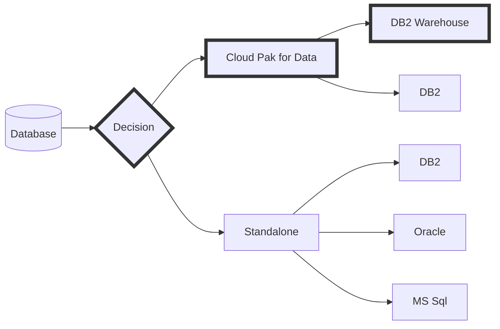
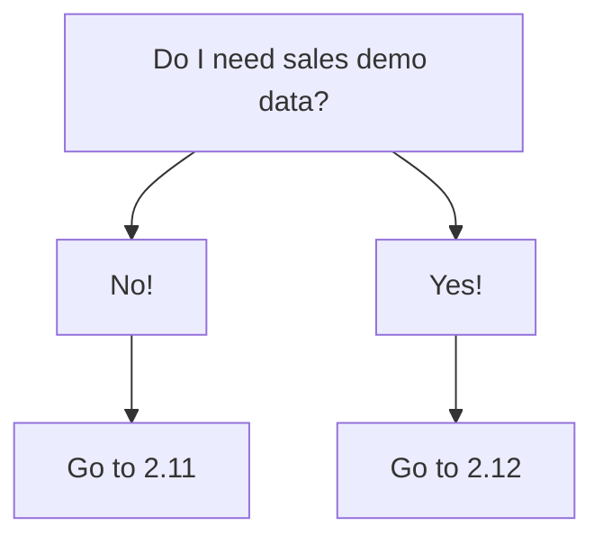
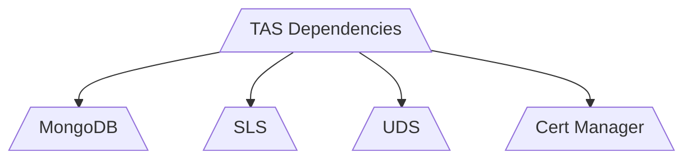
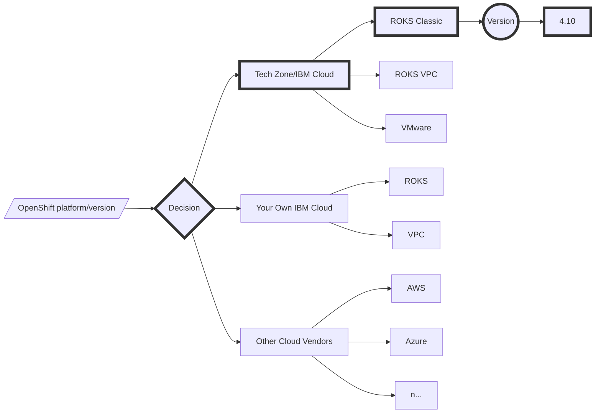

# IBM Tririga Application Suite (TAS) - Automated Implementation

[Deployment cookbook](https://github.com/IBM/my-tas-cookbook). Author: Arif Ali ([aali@us.ibm.com](mailto:aali@us.ibm.com))

The deployment steps and automation scripts were created and adapted from the [official documentation](https://www.ibm.com/docs/en/tas/11.3).

---

## IBM Tririga Application Suite with Cloud Pak for Data (DB2 Warehouse) on Red Hat's OpenShift managed by IBM Cloud

At the time of writing, the deployment script and steps for TAS [version 11.3](https://www.ibm.com/docs/en/tas/11.3?topic=installing-tririga-application-suite-components) had been validated for Red Hat OpenShift Container Platform [version 4.10](https://docs.openshift.com/container-platform/4.10/welcome/index.html) running on [IBM cloud](https://www.ibm.com/cloud/openshift) with IBM Cloud Pak for Data [version 4.5.3](https://www.ibm.com/docs/en/cloud-paks/cp-data/4.5.x?topic=overview-whats-new) including [Db2 Warehouse](https://www.ibm.com/products/db2/warehouse) and [Data Management Console](https://www.ibm.com/products/db2-data-management-console).


---

<div style="page-break-after: always;"></div>

### Table of Content

**- Arrange Prerequisites**

**- Infrastructure decision**

**- Deploy IBM Cloud Pak for Data & database instance**

**- Supply AppPoint License**

**- Set up dependencies**

**- Deploy Tririga Application Suite**

---

### Sequence of steps

**Step 1.** Logistics: Acquire AppPoints license & container software's entitlement key.

**Step 2.** Hands-on: Provision a working environment (Linux instance).

**Step 3.** Hands-on: Provision an OpenShift cluster instance from IBM's Tech Zone.

**Step 4.** Logistics: Arrange the deployment scripts.

**Step 5.** Hands-on: Deploy Cloud Pak for Data and prepare the database.

**Step 6.** Hands-on: Deploy Suite's dependent components.

**Step 7.** Hands-on: Deploy TRIRIGA Application Suite.

---

<div style="page-break-after: always;"></div>

### 1. Arrange prerequisites

#### Estimated overall time ⏰: N/A

1.1. Host computer (a Linux based operating system).

- This will be the working environment, i.e, laptop or a virtual machine with Linux/bash/docker environment. See the Appendix (A) section at the end of this document.

1.2. Red Hat OpenShift cluster.

- Red Hat's OpenShift cluster instance can be acquired through IBM's [Tech Zone](https://techzone.ibm.com) (for IBMers and IBM's business partners). See the Appendix (B) section at the end of this document. 

1.3. AppPoints license.

- Work with your sales representative to obtain an [AppPoints license file](https://www.ibm.com/support/pages/ibm-support-licensing-start-page).
- IBM's Business Partners get access to AppPoint license via their Partner Package purchase/renewals.

1.4. Entitlement key to the IBM's container software.

- To obtain [container software access](https://myibm.ibm.com/products-services/containerlibrary), contact your IBM sales representative. 
- IBM's Business Partners get access to container software via their Partner Package purchase/renewals.

1.5. Deployment Script.

- This cookbook uses BASH scripts for automated implementation. Contact the author with an IBM Sales Cloud opportunity number for PoCs and workshops.

<div style="page-break-after: always;"></div>

### 2. Get Started with the Cloud Pak for Data

#### Database decision



#### Estimated overall time ⏰: 3+ hours

**2.1. The Deployment Script.**

2.1.1. Upload the Deployment Script and extract.

```shell
tar xvf TAS11.3_OCP4.10_CP4D4.5_ROKS.tar.gz; cd TAS11.3_OCP4.10_CP4D4.5_ROKS/
```

2.1.2. 📌 Open `env.sh` file and carefully update all values based on provided instructions.

<div style="page-break-after: always;"></div>

**2.2 The `cpd-cli` tool of IBM Cloud Pak for Data.**

2.2.1. To download and install the `cpd-cli` utility for Cloud Pak for Data (CP4D) on your Linux computer, type the following command. 

```shell
export PATH=$HOME/TAS11.3_OCP4.10_CP4D4.5_ROKS/cpd-cli:$PATH ; wget https://github.com/IBM/cpd-cli/releases/download/v11.3.0/cpd-cli-linux-EE-11.3.0.tgz ; tar xvf cpd-cli-linux-EE-11.3.0.tgz ; mv cpd-cli-linux-EE-11.3.0-52/ cpd-cli
```

**2.3. Log in to OpenShift.**

2.3.1. Click *OpenShift web Console* button. From the top-right corner, drop-down your *account name* and select *Copy login command* (this opens a new tab). From the newly opened browser tab, click *Display Token* link. Copy the entire *Log in with this token* line, paste it on the terminal, and hit *Enter*.

2.3.2. Log in 

```
oc login ... 
```

2.3.3 Log in once again with `cpd-cli manage`

```
cpd-cli manage oc login ...
```

2.3.4. Run the following command to insert your IBM Cloud Pak for Data entitlement key into OpenShift. 

```shell
source env.sh; cpd-cli manage add-icr-cred-to-global-pull-secret ${IBM_ENTITLEMENT_KEY}
```

**2.4. Reload worker nodes.**

⏰ Estimated time for the below mentioned step: 30 minutes.

2.4.1. From the ROKS's dashboard, interactively reload all worker nodes and wait until ready.

<div style="page-break-after: always;"></div>

**2.5. Install Cloud Pak for Data.**

⏰ Estimated time for the below mentioned step: 2+ hour.

2.5.1. Install CP4D (Control Plane, Db2 Warehouse, Data Management Console)

```shell
./cpd.sh
```

**URL and credentials**

When the above mentioned `cpd.sh` command completes, the URL, username (admin) and the password will be shown on the terminal. The next step is mentioned just in case this information is needed again.

```shell
source env.sh; cpd-cli manage get-cpd-instance-details --cpd_instance_ns=${PROJECT_CPD_INSTANCE} --get_admin_initial_credentials=true
```

<div style="page-break-after: always;"></div>

<!-- https://www.ibm.com/docs/en/cloud-paks/cp-data/4.5.x?topic=pi-setting-up-dedicated-nodes -->

#### Estimated overall time ⏰: 20 minutes

**2.7. OPTIONAL: Dedicate a new worker node for the database.**

⛔️NOTE: Dedicating a specific worker node for the database is a documented process by the Cloud Pak for Data team. This process is suitable for production-like deployment scenarios. The "data" is essentially on the storage device and is safe regardless. Skip to the next section without any concerns.

2.7.1. Interactively add a new worker node by increasing the size of the worker pool. Note the private IP address of the newly created worker node: Go to *Worker pools* - *Elipsis menu* - *Resize* - *Click the plus sign once* - *Click Resize*. Wait!

2.7.2. Replace `x.x.x.x` with the IP address of your new worker node as a variable, and run the commands one at a time.

```shell
oc get nodes
```

```shell
export NEW_DEDICATED_NODE=x.x.x.x
```

```shell
oc adm taint node ${NEW_DEDICATED_NODE} icp4data=database-db2wh:NoSchedule --overwrite
```

```shell
oc adm drain ${NEW_DEDICATED_NODE} --ignore-daemonsets --force
```

```shell
oc adm uncordon ${NEW_DEDICATED_NODE}
```

```shell
oc label node ${NEW_DEDICATED_NODE} icp4data=database-db2wh --overwrite
```

<div style="page-break-after: always;"></div>

#### Estimated overall time ⏰: 30 minutes

**2.8. Interactively create the DB2 Warehouse Database instance**

⏰ Estimated time: 15+ minutes.

2.8.1 Using credentials retrieved from above mentioned step, log in to Cloud Pak for Data Web Console.

2.8.2. From the hamburger menu, drop-down *Services*. Click on *Services catalog*. Search `db2` and click the tile for DB2 Warehouse. Click *Provision instance* button.

2.8.3. Using the following matrix, create your database instance:

| Value                        | Key                                |
| ---------------------------- | ---------------------------------- |
| TASDB                        | Database Name                      |
| 6.1 (default)                | CPU per node for Db2 Warehouse     |
| 18 (default)                 | Memory per node for Db2 Warehouse  |
| Un checked (default)         | Deploy database on dedicated nodes |
| Single location for all data | Storage Structure                  |
| Check                        | 4K Sector Size                     |
| Check                        | Oracle compatibility               |
| Operational Analytics        | Workload                           |
| ibmc-file-gold-gid           | Storage class                      |
| 500 GiB                      | Size                               |

**OPTIONAL: If you picked 2.7 above to dedicate a node**

| Value                        | Key                                |
| ---------------------------- | ---------------------------------- |
| TASDB                        | Database Name                      |
| 8                            | CPU per node for Db2 Warehouse     |
| 48                           | Memory per node for Db2 Warehouse  |
| Check                        | Deploy database on dedicated nodes |
| Single location for all data | Storage Structure                  |
| Check                        | 4K Sector Size                     |
| Check                        | Oracle compatibility               |
| Operational Analytics        | Workload                           |
| ibmc-file-gold-gid           | Storage class                      |
| 500 GiB                      | Size                               |

<div style="page-break-after: always;"></div>

**2.9. Create database user (tridata/tridata).**

2.9.1. From the hamburger menu, select *Administration - Access control*. Click *Add user* button. Create username: `tridata` with the password: `tridata`. Click Next. Select *Assign roles directly*. Click Next. Select *User* checkbox as a *Roles*. Click Next. Click *Add*.

2.9.2. From the hamburger menu, select *Services - Instances*. Click on the three-dot menu of the Db2 Warehouse-1 instance and select *Manage access*. Click the *Add users* button. Select *tridata* and choose *Admin* Role. Click *Add* button.

**2.10. Locate DB2's Instance ID number.**

2.10.1. From the hamburger menu, select *Services - Instances*. Click on the *DB2 Warehouse-1* instance. Copy the randomly generated numbered ID from the *Deployment id* field (do not copy the word `db2wh`. Only copy the randomly generated numbers).

2.10.2. Update `env.sh` with DB2W unique ID (line number 50). Save the env.sh file.



**2.11. Prepare Database (no demo data)**

⏰ Estimated time: 5-7 minutes.

2.11.1. Run `./db2wh.sh`

**2.12. Prepare Database (with demo data)**

⏰ Estimated time: 1+ hour.

2.12.1. Run `./salesdb.sh`

Please keep in mind that dummy sales data is only available to IBMers and IBM's business partners with special permission and request.

---

<div style="page-break-after: always;"></div>

### 3. Supply Tririga AppPoint License

3.1. (This is an interactive process. Contact the author if you are not familiar with the bootstrap process). Copy license to /manifests/sls/slsbootstrap.yaml

---

### 4. Set up dependent components



#### Estimated overall time ⏰: 45 minutes

4.1. Run `./dependencies.sh`

---

### 5. Deploy Tririga Application Suite

⏰ Estimated time: 2-3 hours.

5.1. Run `./tas.sh`

---

no sales data: system/admin (/tririga/index.html)

sales data: step 1: configure license for the user ssystem/smarter (/tririga/html/en/default/admin) - Suite Configure - Add ssytem. step 2: log in (/tririga/index.html)

<div style="page-break-after: always;"></div>

### Appendix A: Linux host via IBM's Tech Zone

- [OCP CLI](https://techzone.ibm.com/collection/633a325bbf9bca0017d50db8) - Author's solution for a Linux virtual machine with all the necessary tools and utilities, via IBM's Tech Zone. 

### Appendix B: OpenShift instance via IBM's Tech Zone

- OpenShift 4.10 via IBM's Tech Zone - [ROKS](https://techzone.ibm.com/collection/custom-roks-vmware-requests)

| Name                | IBM RedHat Openshift Kubernetes Service (ROKS) |
| ------------------- | ---------------------------------------------- |
| Purpose             | Practice / Self-Education                      |
| Customer names(s)   | Leave blank                                    |
| Purpose description | PoC                                            |
| Preferred Geography | Select your nearest data center location       |
| Worker Node Count   | 3                                              |
| Worker Node Flavor  | b3c.16x64 300gb                                |
| NFS Size            | 4 TB or leave default none                     |
| OpenShift Version   | 4.10                                           |
| Notes               | Leave blank                                    |

#### Infrastructure decision



### Appendix C: Data Management Console (optional)

1. Using credentials retrieved earlier, log in to Cloud Pak for Data Web Console.

2. From the hamburger menu, drop-down *Services*. Click on *Services catalog*. Search for `dmc` and click the tile for DB2 Data Management Console. Click *Provision instance* button.

3. Using the following matrix, create a new service instance:

| Value         | Key                |
| ------------- | ------------------ |
| Compute       | Small              |
| Storage class | ibmc-file-gold-gid |
| Storage size. | 20                 |
