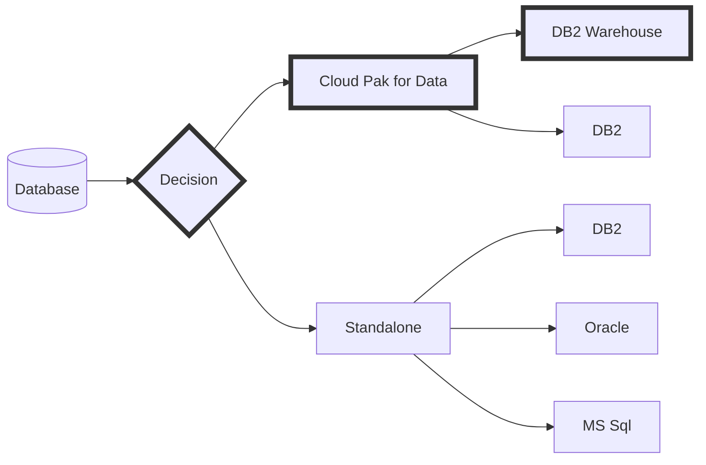
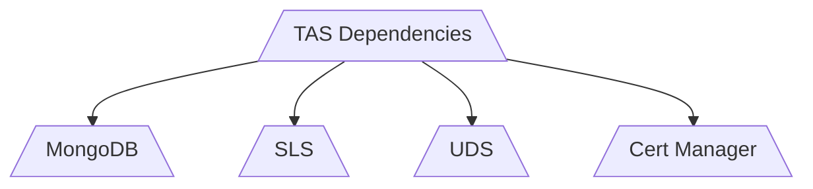
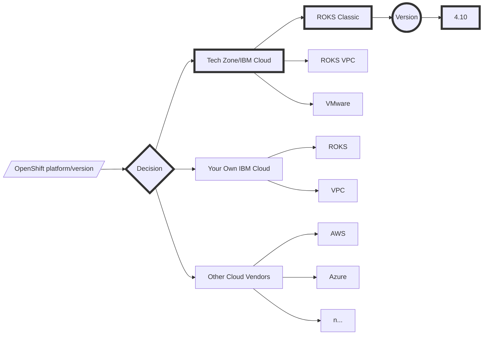

# IBM TRIRIGA Application Suite (TAS) - Automated Implementation

[Deployment cookbook](https://github.com/IBM/my-tas-cookbook). Author: Arif Ali

The deployment steps and automation scripts were created and adapted from the [official documentation](https://www.ibm.com/docs/en/tas/11.5). 

---

## IBM TRIRIGA Application Suite (TAS) with Cloud Pak for Data with DB2 Warehouse (CPD/DB2W) on Red Hat's OpenShift Container Platform (RHOCP)

At the time of writing, the deployment script and steps for TAS [version 11.5](https://www.ibm.com/docs/en/tas/11.5?topic=installing-tririga-application-suite-components) had been validated for Red Hat OpenShift Container Platform [version 4.12](https://docs.openshift.com/container-platform/4.12/welcome/index.html) with IBM Cloud Pak for Data [version 4.6.6](https://www.ibm.com/docs/en/cloud-paks/cp-data/4.6.6?topic=overview-whats-new) including [Db2 Warehouse](https://www.ibm.com/products/db2/warehouse).

---

#### Estimated overall time ⏰: 3+ hours

### Table of Content

**- Arrange Prerequisites**

**- Infrastructure decision**

**- Deploy IBM Cloud Pak for Data & database instance**

**- Supply AppPoint License**

**- Set up dependencies**

**- Deploy Tririga Application Suite**

---

### Sequence of steps

**Step 1.** Logistics: Acquire AppPoints license & container software's entitlement key.

**Step 2.** Hands-on: Provision a working environment (Linux instance).

**Step 3.** Hands-on: Provision an OpenShift cluster instance from IBM's Tech Zone.

**Step 4.** Logistics: Arrange the deployment scripts.

**Step 5.** Hands-on: Deploy Cloud Pak for Data and prepare the database.

**Step 6.** Hands-on: Deploy Suite's dependent components.

**Step 7.** Hands-on: Deploy TRIRIGA Application Suite.

---

### 1. Arrange prerequisites

1.1. Host computer (a Linux based operating system).

- This will be the working environment, i.e, laptop or a virtual machine with Linux/bash/docker environment. See the Appendix (A) section at the end of this document.

1.2. Red Hat OpenShift cluster.

- Red Hat's OpenShift cluster instance can be acquired through IBM's [Tech Zone](https://techzone.ibm.com) (for IBMers and IBM's business partners). See the Appendix (B) section at the end of this document. 

1.3. AppPoints license.

- Work with your sales representative to obtain an [AppPoints license file](https://www.ibm.com/support/pages/ibm-support-licensing-start-page).
- IBM's Business Partners get access to AppPoint license via their Partner Package purchase/renewals.

1.4. Entitlement key to the IBM's container software.

- To obtain [container software access](https://myibm.ibm.com/products-services/containerlibrary), contact your IBM sales representative. 
- IBM's Business Partners get access to container software via their Partner Package purchase/renewals.

1.5. Deployment Script.

- This cookbook uses BASH scripts for automated implementation. Contact the author with an IBM Sales Cloud opportunity number for PoCs and workshops.

---

### 2. Get Started with the Cloud Pak for Data

#### Database decision

**The Deployment Script.**

**The `cpd-cli` tool of IBM Cloud Pak for Data.**

**Logging in to OpenShift.**

**Install Cloud Pak for Data.**

**URL and credentials**

**DB2 Warehouse Database instance**

**Prepare Database**

---

### 3. Set up dependent components

### 4. Deploy TRIRIGA Application Suite

---

### Appendix A: Linux host via IBM's Tech Zone

### Appendix B: OpenShift instance via IBM's Tech Zone

#### Infrastructure decision

